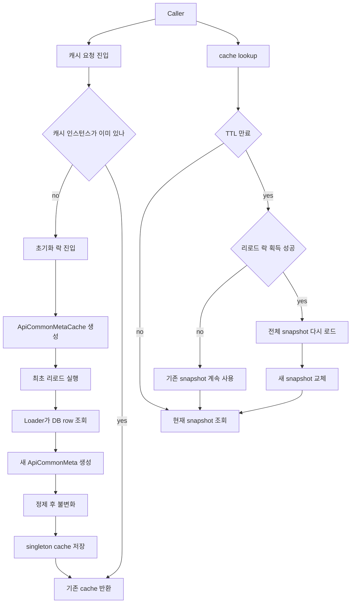

# Snapshot Cache 구조 정리

이 저장소의 핵심은 `static + synchronized` 자체를 완전히 없앤 것이 아니라, **동기화가 걸리는 구간을 "최초 1회 초기화"와 "리로드"로만 좁히고**, 평소 조회는 **불변 스냅샷 + 원자적 참조 교체**로 처리하게 바꾼 점이다.

코드 기준으로 보면:

- 진입점: `ApiCaches.java`
- 실제 캐시 엔진: `ApiCommonMetaCache.java`
- 스냅샷 모델: `ApiCommonMeta.java`
- 불변 내부 구조: `ApiEndpointMetadataSnapshot.java`, `ApiEndpointRoutingSnapshot.java`
- 과거 구조를 보여주는 보존 코드: `ApiCachesValidationArchive.java`

## 1. 지금 스냅샷 캐시는 어떻게 동작하나

현재 구조는 크게 2단계다.

1. `ApiCaches.apiEndpointCache(...)`가 **정적 싱글톤 캐시 인스턴스**를 lazy-init 한다.
   - 여기서는 여전히 `static`과 `synchronized(API_ENDPOINT_INIT_LOCK)`를 쓴다.
   - 목적은 "캐시 객체를 한 번만 만든다"는 보장이다.

2. 실제 조회/갱신은 `ApiCommonMetaCache`가 담당한다.
   - 현재 스냅샷은 `AtomicReference<ApiCommonMeta>` 안에 들어 있다.
   - 조회는 `snapshotRef.get()`으로 끝난다.
   - TTL이 만료되면 한 스레드만 `reloadLock.tryLock()`으로 리로드를 수행한다.
   - 리로드는 DB 결과를 새 `ApiCommonMeta`로 만들고, `sanitizeAndFreeze(...)`로 내부 Map들을 불변 구조로 정리한 뒤, `snapshotRef.set(next)`로 한 번에 교체한다.

즉, 평소 읽기 경로는 "락을 잡고 Map을 만지작거리는 방식"이 아니라, **이미 완성된 스냅샷 객체를 그대로 바라보는 방식**이다.

## 2. 흐름도



## 3. 과거 `static + synchronized` 구조와의 차이

이 repo 안에는 "모든 조회를 `synchronized`로 감싸던 완전한 과거 버전"이 그대로 남아 있지는 않다. 대신 과거 구조의 흔적은 `ApiCaches.java`와 `ApiCachesValidationArchive.java`에 남아 있다. 그래서 비교는 **코드에 남아 있는 정적 초기화 방식**과 **현재 스냅샷 런타임 방식**을 기준으로 보는 것이 정확하다.

| 비교 항목 | 과거 `static + synchronized` 중심 구조 | 현재 snapshot cache 구조 |
|---|---|---|
| 캐시 보관 방식 | 정적 필드에 캐시/맵을 두고 락으로 보호 | `AtomicReference<ApiCommonMeta>`가 완성된 스냅샷을 가리킴 |
| 초기화 | `synchronized`로 1회 생성 | 동일하게 1회 생성은 `synchronized` 사용 |
| 조회 경로 | 락 범위 안에서 읽거나, 공유 mutable 상태를 직접 참조하는 쪽에 가까움 | `snapshotRef.get()`으로 락 없이 조회 |
| 갱신 방식 | 기존 구조를 수정하거나, 락을 오래 잡을 가능성이 큼 | 새 스냅샷을 따로 만든 뒤 마지막에 참조만 교체 |
| 동시성 충돌 시 | 읽는 쪽도 대기할 가능성이 큼 | 리로드 중이어도 다른 스레드는 기존 스냅샷 계속 사용 |
| 실패 시 안정성 | 갱신 도중 상태 관리가 복잡해질 수 있음 | 새 로드가 실패하면 이전 스냅샷을 그대로 유지 |

핵심은 **"정적 싱글톤인지 아닌지"보다 "읽는 순간에 공유 가변 상태를 만지느냐"**다. 지금 구조는 정적 진입점은 유지하지만, 캐시 내용물은 불변 스냅샷으로 바꿔서 읽기 비용과 동시성 부담을 크게 낮췄다.

## 4. 왜 이 방식이 유용한가

### 4-1. 읽기 성능이 좋다

이 캐시는 읽기가 매우 많고, 갱신은 드문 상황에 맞춰져 있다. `getApiUrlOrNull`, `getHttpMethodOrNull`, `snapshot()` 모두 사실상 현재 참조를 읽는 작업이라서, 조회마다 큰 락 경쟁이 생기지 않는다.

### 4-2. 반쯤 갱신된 상태를 노출하지 않는다

리로드는 기존 Map을 부분 수정하지 않고, **새 객체를 통째로 만든 뒤 마지막에 교체**한다. 그래서 호출자는 항상 "이전 완성본" 또는 "새 완성본" 둘 중 하나만 본다.

### 4-3. 리로드 실패에 강하다

`tryReloadIfExpired(...)`나 `tryReload(...)`가 실패해도 기존 `snapshotRef`는 그대로 남는다. 즉 DB가 순간적으로 불안정해도 서비스는 마지막 성공 스냅샷으로 계속 응답할 수 있다.

### 4-4. 리로드 중에도 읽는 쪽이 멈추지 않는다

TTL이 만료되어도 모든 스레드가 대기하지 않는다. `reloadLock.tryLock()`에 실패한 스레드는 그냥 기존 스냅샷을 읽는다. 이건 "잠깐 stale 할 수는 있지만, 전체 요청이 막히지는 않는다"는 선택이다.

## 5. 대신 생기는 트레이드오프

- **약간의 stale window**: TTL 기반이라 만료 전까지는 예전 데이터가 유지될 수 있다.
- **리로드는 전체 재구성 비용이 든다**: 변경분만 패치하는 구조가 아니라, 스냅샷을 새로 만든다.
- **교체 순간 메모리가 잠깐 2벌 필요할 수 있다**: 이전 스냅샷과 새 스냅샷이 동시에 존재할 수 있기 때문이다.

그래도 이 저장소의 사용 패턴처럼 **읽기 빈도 >> 갱신 빈도**라면, 보통 이 쪽이 더 단순하고 안전하다.

## 6. 이 코드에서 실제로 보이는 결론

한 줄로 정리하면 이렇다.

> 예전 사고방식이 "정적 공유 객체를 락으로 지킨다"였다면, 지금 구조는 "정적 진입점은 유지하되, 내용물은 불변 스냅샷으로 만들고 교체만 원자적으로 한다"에 가깝다.

그래서 유용한 점은 다음 세 가지다.

1. 조회가 빠르다.
2. 리로드 도중에도 호출자가 깨진 중간 상태를 보지 않는다.
3. 리로드 실패 시 마지막 정상 스냅샷으로 계속 버틸 수 있다.

## 7. 확인에 사용한 코드/실행 근거

- 코드 읽기:
  - `ApiCaches.java`
  - `ApiCommonMetaCache.java`
  - `ApiCommonMeta.java`
  - `ApiEndpointMetadataSnapshot.java`
  - `ApiEndpointRoutingSnapshot.java`
  - `ApiCachesValidationArchive.java`
- 실행 확인:
  - `mvn -q -DskipTests compile`
  - `mvn -q -DskipTests exec:java -Dexec.mainClass=com.mydata.cache.examples.ApiEndpointCacheUsageExample`

예제 실행 결과:

```text
cacheSize=2
apiUrl=/v1/balance
httpMethod=POST
```
